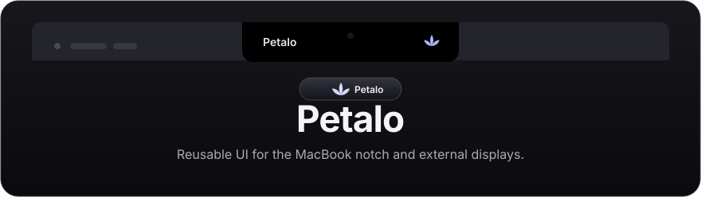

<p align="center">
  
</p>

# Petalo

**A native macOS contextual assistant attached to the notch.**

Petalo preserves its physical-notch placement, external-display pill, Liquid Glass rendering, hit testing, and display selection while adding three optional global actions: ask about selected text, ask about a selected screen region, or ask ChatGPT directly with no context. The first two capture source context before Petalo activates a focused prompt bubble; the third opens the prompt ready to type.

Petalo remains local-only: it has no network client, API keys, accounts, telemetry, conversation history, process scanning, or prompt/capture persistence.

## Requirements

- macOS 14 Sonoma or later;
- Swift 6.0 or later to build from source.

## Build and run

```bash
swift build
swift run petalo-tests
./scripts/build-app.sh
open .build/Petalo.app
```

Use the compact Petalo control to open its surface, then its gear control for Settings. Settings let you place it on the display with the pointer, the display with the focused window, or every connected display. Displays with a camera housing use the hanging-notch presentation; other displays use a pill contained in the menu-bar strip.

## Contextual actions

- **Ask about selected text** defaults to `⌘⇧C`. Petalo asks for Accessibility only after this action is invoked, reads the focused control's selected text, then opens the prompt. Apps that do not expose selected text fail safely with an explanation.
- **Ask about screen region** defaults to `⌘⇧S`. Petalo asks for Screen Recording only after this action is invoked, shows a cancellable crosshair overlay on the invocation display, and captures the selected area in memory. A drag is constrained to that one display.
- **Ask ChatGPT directly** defaults to `⌘⇧A`. Petalo opens the prompt with no captured context — the user types a question and sends. No permissions are required; the workflow submits from idle via `beginDirectDelivery` with an `.none` context, the same path as hovering or clicking the compact bar.
- The prompt is a separate key-capable Liquid Glass panel; the existing `NotchPanel` stays non-key and keeps passing transparent-corner clicks through. The field supports dictation, `Enter` to send, `Shift+Enter` for a newline, and `Esc` to cancel.

All three shortcuts can be recorded, changed, disabled, and restored in Settings. Petalo reports duplicate or system registration failures there. Settings also show current permission status and open the matching Privacy & Security pane.

## ChatGPT handoff

There is no documented ChatGPT macOS API for creating a conversation with text and an image. Petalo therefore delivers the prepared prompt by copying it to the clipboard, opening the native ChatGPT app (`com.openai.chat`), and simulating `Cmd+V` followed by `Return` using synthetic keyboard events. For image payloads the image is pasted first, then the instruction text, then `Return`. Petalo does not target a specific ChatGPT window or conversation; it sends events to whichever view ChatGPT presents after activation. If the app is unavailable, Petalo reports that safely.

The clipboard's prior contents are held only in memory for up to two minutes and restored only if Petalo can prove its temporary clipboard data has not been replaced. See [Privacy](PRIVACY.md) for the data-lifetime contract.

## Install locally

```bash
./scripts/install.sh
```

The installer builds and installs only `Petalo.app`. It does not add, modify, or remove terminal hooks, plugins, configuration files, or session data from any prior tool.

## Architecture

- `PetaloApp` owns the SwiftUI lifecycle, notch/prompt/selection panels, permissions, global hotkeys, ScreenCaptureKit, and the capability-gated ChatGPT handoff.
- `PetaloCore` contains framework-neutral layout, geometry, hover, display selection, contextual workflow/payload/shortcut policy, and single-instance-lock logic.
- `ContextualAssistantCoordinator` captures source context before it activates the prompt and clears payload state after every terminal workflow outcome.

Read [Architecture](docs/ARCHITECTURE.md) for details.

## Verification

```bash
swift build
swift run petalo-tests
./scripts/build-app.sh
```

## License

[MIT](LICENSE) © 2026 Inakitajes
